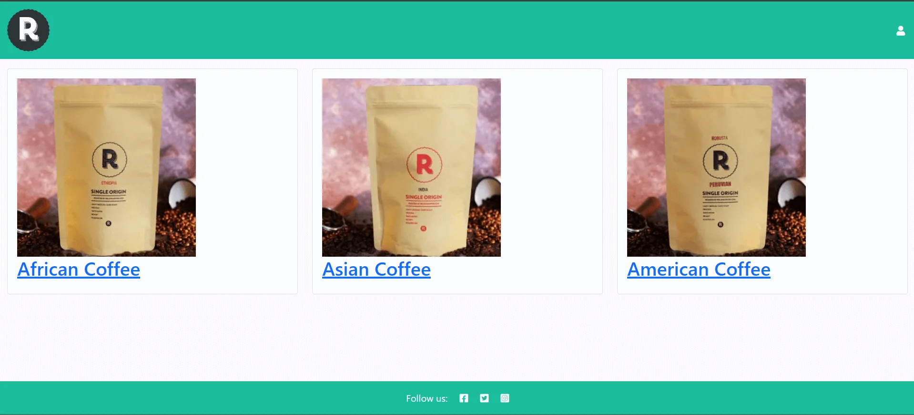
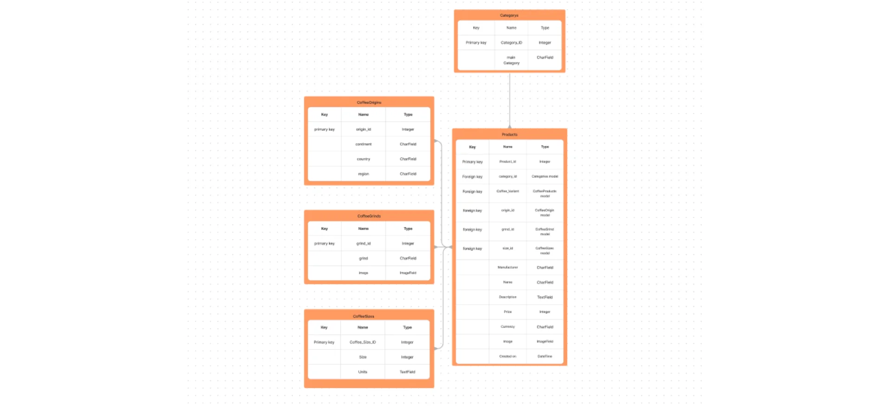
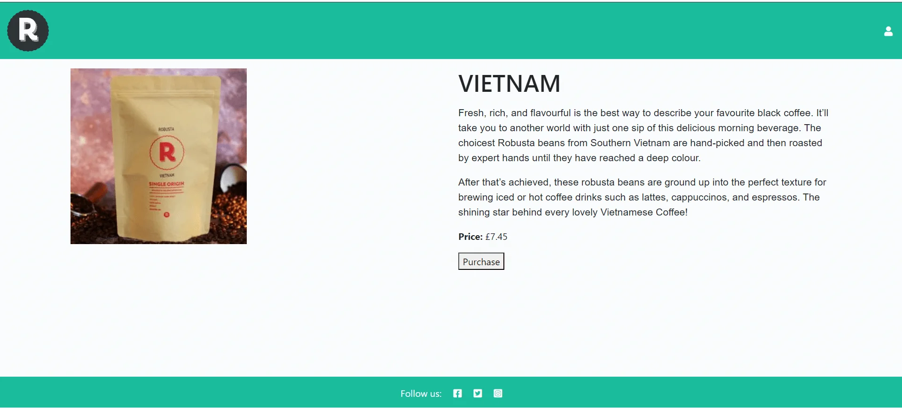
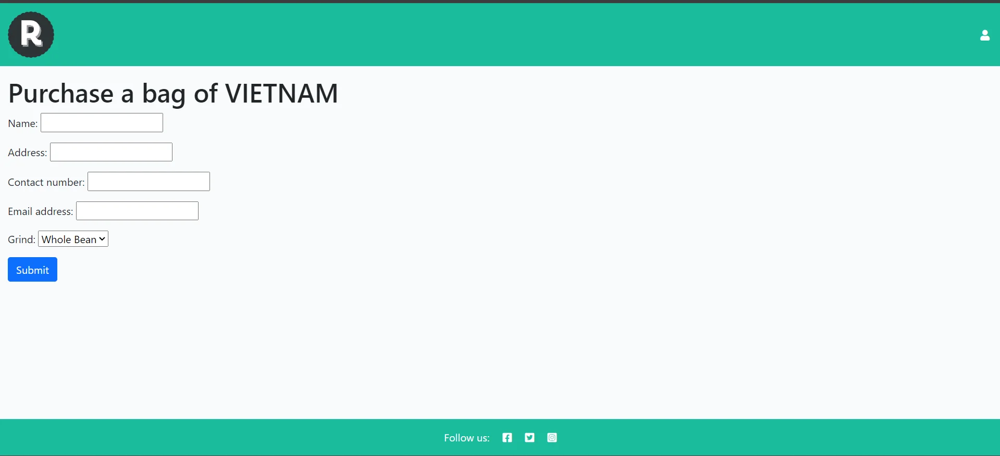
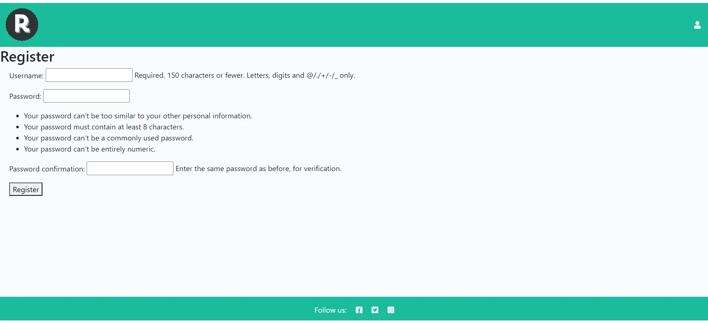
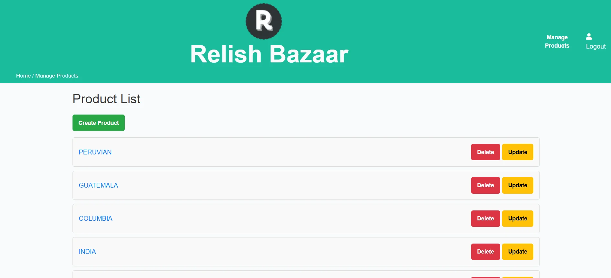
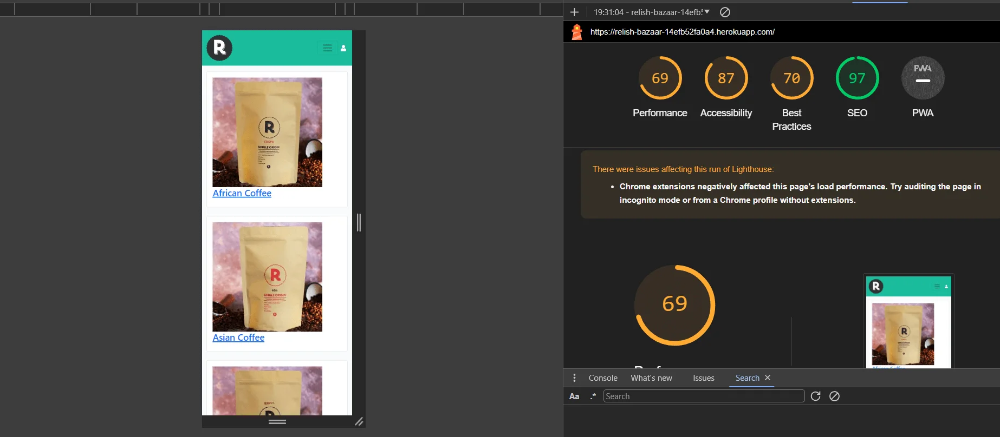
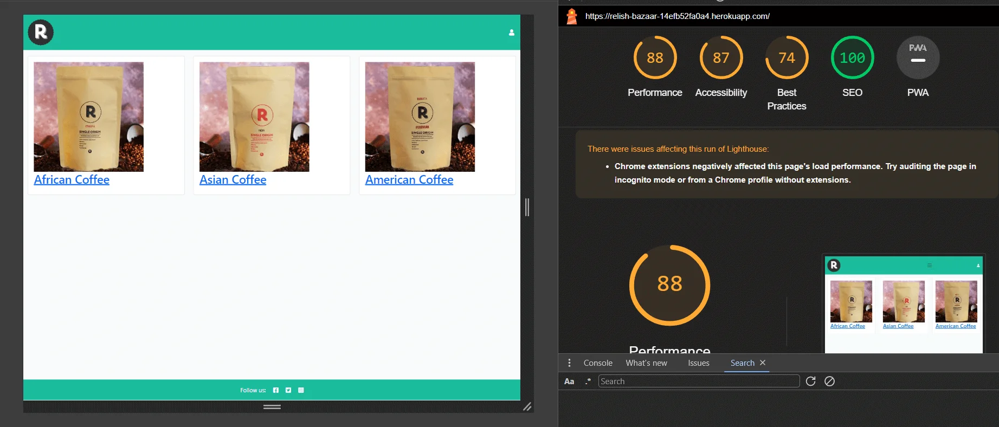

# Relish Bazaar - Coffee Shop Website

Welcome to Relish Bazaar, your ultimate online coffee shop experience! This project aims to create an interactive and user-friendly website for our coffee shop, providing customers with an easy way to browse and make enquires.

## Introduction

Relish Bazaar is a web-based application designed to streamline the coffee ordering process for customers. The website features an intuitive interface where users can explore our menu and customize their orders.

## Key Objectives

The key objectives for the Relish Bazaar coffee shop website project are as follows:

Enhance User Experience:

Provide an intuitive and visually appealing interface for customers to browse and make enquires.
Ensure the website is responsive and accessible on various devices and screen sizes.

Efficient Data Management:

Implement a robust database structure using Entity-Relationship Diagrams (ERDs) to ensure data integrity and efficiency.
Facilitate easy addition, modification, and deletion of menu items by the admin through a user-friendly admin interface.
Security and Reliability:

Ensure secure handling of user data, including encrypted storage of passwords.
Perform thorough testing, including unit tests, to ensure the reliability and correctness of the codebase.

Maintainability and Scalability:

Write clean, maintainable, and well-documented code adhering to coding standards such as PEP8 for Python.
Design the system to be scalable to handle an increasing number of users and orders as the business grows.
Compliance with Web Standards:

Validate HTML, CSS, and JavaScript code to ensure compliance with web standards and improve cross-browser compatibility.
Ensure the website is accessible to users with disabilities, following accessibility guidelines.

## Design Process

Entity-Relationship Diagrams (ERD)

Entity-Relationship Diagrams (ERDs) played a crucial role in the design process of Relish Bazaar. ERDs help in visualizing the database structure, showing how entities such as Categories, Coffee Origin, Coffee Grind, Coffee size, products and how they  relate to each other. This design step ensures a well-organized database, improving data integrity and efficiency.

Key Entities include:

Category: Groups coffee into categories like "Arabica", "Robusta".
CoffeeOrigin: Specifies the origin of the coffee beans used in the menu items, such as "Colombia", "Ethiopia", or "Brazil".
CoffeeGrind: Defines the grind level of the coffee, such as "Whole Bean", "Course", "Medium", "Fine".
CoffeeSize: Details the available sizes for coffee bags, currently "250g".

## User Stories

User stories were essential in guiding the development process, ensuring that the website meets the needs of its users.

### Screenshots

### 2. Responsive Design

Create a responsive and visually appealing user interface that works seamlessly on various devices, including desktops, tablets, and mobile phones. Prioritize a user-friendly experience with clear instructions and intuitive controls.

### 4. Stylish UI/UX

Design an aesthetically pleasing user interface with appropriate styling using CSS. Utilize visual elements to enhance the experience and make the interface more engaging.

### 5. Code Organization

Maintain a well-organized codebase with clear separation of concerns. Use separate HTML, CSS, and JavaScript files to enhance readability and ease of maintenance. Comment the code where necessary to provide insights into the implementation details.

# Testing

## Unit Tests

Unit tests were written to ensure the reliability and correctness of the code. Each function and component of the website was tested individually to verify that they work as expected. The tests cover various aspects such as:

Form validation
User authentication
Enquiry processing
Menu item management
Code Validation

The test results can be seen in the TESTING.md file.

All Python code was validated against the PEP8 style guide to maintain readability and consistency. PEP8 compliance helps in keeping the codebase clean and manageable.

## HTML Validator

The HTML code was validated using the W3C HTML Validator to ensure it meets web standards but has one error.

- The Ethiopian paragraph is doubled up on open and close tags 
 
, but when I check the admin panel and click on code view they are not doubled up.

#### Testing Screenshots

## Bugs

The are no bugs in the system.

# Getting Started

## Prerequisites

Python 3.x
Django
A web browser for testing

## Installation

Clone the repository:

git clone https://github.com/Ross-Fraser/relish-bazaar.git

Navigate to the project directory:

cd relish-bazaar

Install the required dependencies:

pip install -r requirements.txt

## Usage

To start the development server, run:

python manage.py runserver

Open your web browser and go to http://127.0.0.1:8000/ to see the website in action.

## Contributing

We welcome contributions to improve Relish Bazaar! Please fork the repository and submit pull requests for any enhancements or bug fixes.

## License

This project is licensed under the MIT License. See the LICENSE file for more details.

## Credit

Code Institute for template
Code Institute for the deployment terminal.
PEP8 Validator for code validation.
3wSchools.com for breadcrumbs and permissions
